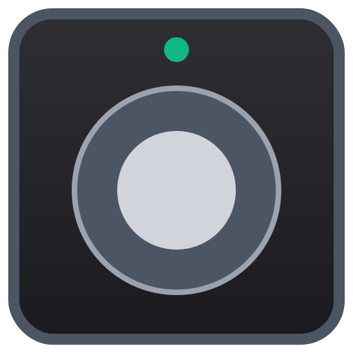

<div align="center">

# 🎸 Pedalis



**A software-first virtual pedalboard for controlling guitar plugins over MIDI — with optional cheap USB foot controller support.**

Built with Tauri (Rust) + React + TypeScript. No DAW required. No expensive MIDI controller required.

[](https://tauri.app)
[](https://react.dev)
[](https://www.rust-lang.org)
[](#license)

</div>

---

## What is this?

Pedalis turns your screen (and eventually a DIY footswitch box) into a
pedalboard that sends real MIDI CC/PC messages to **any MIDI-learnable plugin**
— Neural DSP Archetype series, amp sims, looper plugins, lighting software,
whatever speaks MIDI.

Click a stomp, it sends MIDI. Click a scene, it reconfigures your whole rig in
one shot. Plug in a hardware footswitch later and the same mappings just work
— no software dependency on the hardware ever existing.

```
[Physical Footswitch Box]  (optional)
        │ USB Serial
        ▼
┌─────────────────────────────┐        ┌──────────────────────┐
│   Pedalis (Tauri App)       │  MIDI  │   Your Plugin/DAW    │
│   Rust backend ── React UI  │ ─────► │ (Archetype, etc.)    │
└─────────────────────────────┘        └──────────────────────┘
```

---

## Features

- 🎛️ **Virtual pedalboard** — click or hotkey stomps on/off, each firing custom MIDI CC/PC messages
- 🎬 **Scenes** — one click recalls a whole rig state (e.g. "Lead" = boost+delay+reverb on, chorus off)
- ⌨️ **Keyboard hotkeys** — fully usable with zero hardware, bind any key to any stomp or scene
- 🔌 **Hardware-ready** — auto-detects a USB serial foot controller (Raspberry Pi Pico / Arduino), no extra config
- 💾 **Profiles** — save/load entire rigs (stomps + scenes + mappings) as named, swappable JSON profiles
- ✏️ **In-app editor** — add, rename, recolor, rebind, and delete stomps/scenes without touching code
- 🪶 **Lightweight** — Tauri instead of Electron, so it's a ~10MB binary with near-zero idle CPU

---

## Quick Start

### 1. Prerequisites

| Tool | Why |
|---|---|
| [Rust](https://rustup.rs/) (stable) | Powers the backend (MIDI + serial) |
| [Node.js](https://nodejs.org/) 18+ | Builds the React frontend |
| OS-specific Tauri deps | See below |

<details>
<summary><b>macOS</b></summary>

```bash
xcode-select --install
```
</details>

<details>
<summary><b>Windows</b></summary>

Install the **Microsoft C++ Build Tools** and **WebView2 Runtime** (WebView2 ships with Win10/11 by default).
</details>

<details>
<summary><b>Linux</b></summary>

```bash
sudo apt install libwebkit2gtk-4.0-dev build-essential curl libssl-dev \
  libgtk-3-dev libayatana-appindicator3-dev librsvg2-dev \
  libasound2-dev libudev-dev
```
`libasound2-dev` → required by `midir` (MIDI). `libudev-dev` → required by `serialport` (hardware).
</details>

### 2. Clone & run

```bash
git clone https://github.com/VBPedersen/Pedalis.git
cd Pedalis
bun install
bun run tauri dev      # hot-reload dev mode
```

### 3. Build a release binary

```bash
bun run tauri build
```
Output lands in `src-tauri/target/release/bundle/`.

---

## Connecting to a Plugin (MIDI Setup)

Pedalis talks to plugins through a **virtual MIDI cable** — a loopback port
that exists only on your machine, routing MIDI from Pedalis into your
DAW/plugin's MIDI input.

### macOS — built-in IAC Driver

1. Open **Audio MIDI Setup** (⌘+Space → search it)
2. **Window → Show MIDI Studio**
3. Double-click **IAC Driver** → check **"Device is online"**
4. `IAC Driver Bus 1` will now show up in Pedalis's MIDI dropdown and in your plugin's MIDI input list

### Windows — loopMIDI

1. Download [loopMIDI](https://www.tobias-erichsen.de/software/loopmidi.html)
2. Click `+` to create a virtual port (name it whatever — e.g. "Pedalis")
3. **Leave loopMIDI running** in the background — it must be open before you launch Pedalis
4. The port appears in both Pedalis's dropdown and your plugin's MIDI input list

> If your port doesn't show up in Pedalis, hit the ↻ refresh icon next to "MIDI Output" in the sidebar — ports are scanned on demand, not live-polled.

### Linux — ALSA virtual MIDI

```bash
sudo modprobe snd-virmidi
```
This creates virtual MIDI ports visible to both Pedalis and ALSA-aware plugins/DAWs.

---

## Using Pedalis with a Plugin

This works with **any plugin or software that supports MIDI Learn or accepts custom MIDI MAPPINGS** — not just
Neural DSP. The general flow:

1. **Connect MIDI**: in Pedalis's sidebar, pick your virtual loopback port from the **MIDI Output** dropdown
2. **Open your plugin** (e.g. Archetype: John Mayer) in your DAW or standalone host, with its MIDI input set to the same virtual port
3. **Enter MIDI Learn** on the plugin parameter you want to control (most plugins: right-click → "MIDI Learn" or similar)
4. **Trigger the matching stomp** in Pedalis — click it once. The plugin should detect the CC/PC message and bind it
5. Repeat for each stomp/scene

Once bound, every click (or hotkey, or hardware footswitch press) sends that
exact MIDI message — toggling, switching presets, or sweeping a parameter,
depending on what you mapped.

### Editing MIDI mappings in-app

You don't need to touch code. Hover any pedal and click the pencil icon ✏️ to open its editor:

- **Label, color, hotkey** — cosmetic + keyboard binding
- **MIDI — On Press** — one or more CC/PC messages sent when the stomp activates
- **MIDI — On Release / Off** — messages sent when it deactivates (defaults to value `0` if left as-is)

Channel numbers in the editor are shown as **1–16** to match how Archetype
and most plugins display them — the app handles the 0–15 wire conversion
internally, so just match whatever your plugin shows.

Scenes work the same way — hover a scene in the sidebar, click ✏️, and toggle
each stomp's desired on/off state for that scene.

### Profiles

Use the **Profile** panel at the top of the sidebar to:

- **Save** — overwrite the current profile with your latest changes
- **New** — save your current setup as a new named profile, leaving the original untouched
- **Switch profiles** — pick from the dropdown to instantly swap your entire rig (different stomps, scenes, and mappings per profile — handy for different plugins or songs)
- **Delete** — remove a saved profile

Profiles are stored as JSON in your OS's app data directory and persist
between launches; Pedalis reopens to whichever profile you last had active.

---

## Hardware Foot Controller (TO COME)

Pedalis's software works standalone with hotkeys/mouse — but is supposed to connect with hardware stomp box.


In Pedalis's sidebar, pick your device's COM port under **Hardware
(USB)**. No further config needed — switch presses map to stomps by
position, and the expression value is auto-scaled to MIDI CC 11 (0–127).

**Recommended hardware**: Raspberry Pi Pico + momentary footswitches + a
passive expression pedal in a 1590BB aluminum enclosure. Firmware can be C++
(Arduino-style) or embedded Rust (`rp2040-hal`/`embassy`).

---

## Project Structure

```
Pedalis/
├── src/                          # React + TypeScript frontend
│   ├── App.tsx                   # Root layout, modal wiring
│   ├── components/
│   │   ├── StompPedal.tsx        # Individual pedal button + edit trigger
│   │   ├── StompEditor.tsx       # Modal: name/color/hotkey/MIDI CC editor
│   │   ├── SceneSelector.tsx     # Scene buttons in sidebar
│   │   ├── SceneEditor.tsx       # Modal: scene config + per-stomp states
│   │   ├── ProfileBar.tsx        # Profile save/load/delete UI
│   │   ├── ConnectionPanel.tsx   # MIDI + serial port pickers
│   │   └── Modal.tsx             # Shared modal shell
│   ├── hooks/
│   │   └── useHotkeys.ts         # Global keyboard shortcut listener
│   ├── lib/
│   │   ├── constants.ts          # Color palette, ID generator
│   │   └── profileStorage.ts     # JSON profile read/write (Tauri fs)
│   ├── store/
│   │   └── useStore.ts           # Zustand state, MIDI dispatch, CRUD, profiles
│   └── types/
│       └── index.ts              # Shared TypeScript types
├── src-tauri/
│   ├── src/main.rs               # Rust backend: MIDI (midir), serial, Tauri commands
│   ├── Cargo.toml                # Rust dependencies
│   └── tauri.conf.json           # Window/bundle/fs allowlist config
└── README.md
```

---

## Tech Stack

| Layer | Choice | Why |
|---|---|---|
| Shell | [Tauri](https://tauri.app) | Rust backend with near-zero-latency system access, ~10MB binaries vs Electron's 100MB+ |
| Frontend | React + TypeScript + Tailwind | Fast iteration, full type safety on MIDI message shapes |
| State | [Zustand](https://github.com/pmndrs/zustand) | Minimal boilerplate, no context provider hell |
| MIDI | [`midir`](https://github.com/Boddlnagg/midir) (Rust) | Cross-platform, real-time MIDI I/O |
| Serial | [`serialport`](https://gitlab.com/susurrus/serialport-rs) (Rust) | Hardware foot controller communication |
| Persistence | Tauri `fs` API | Profiles stored as plain JSON, human-readable and git-friendly |

---

## Roadmap

- [x] Virtual pedalboard with MIDI CC/PC output
- [x] Scene macro engine
- [x] Keyboard hotkeys
- [x] MIDI port selector with refresh
- [x] Serial hardware listener
- [x] In-app stomp/scene editor (CRUD)
- [x] Persistent profiles (save/load/delete, multi-profile)
- [ ] Drag-to-reorder stomps
- [ ] Expression pedal calibration screen (min/max sweep capture)
- [ ] LED feedback write-back to hardware

---

## License

MIT — do whatever you want with it.
